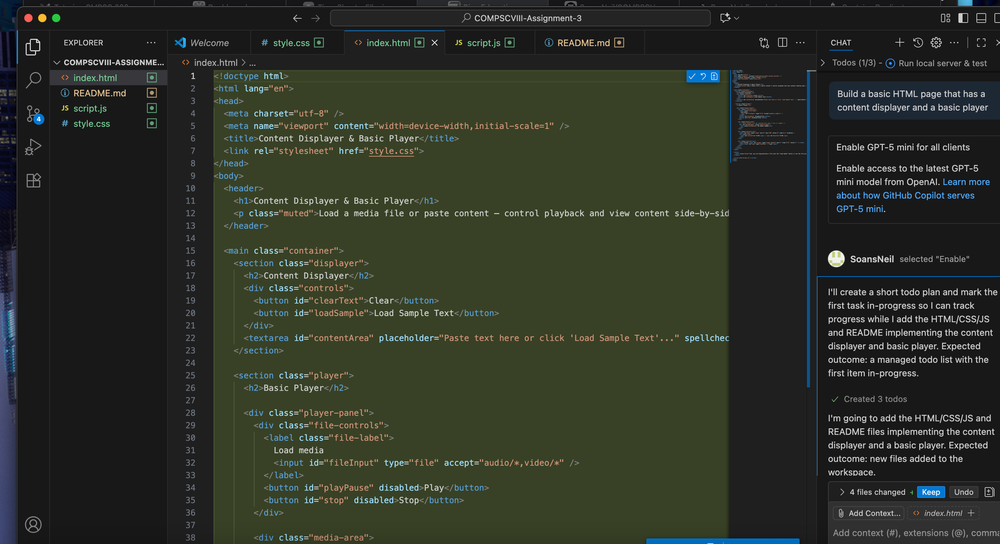
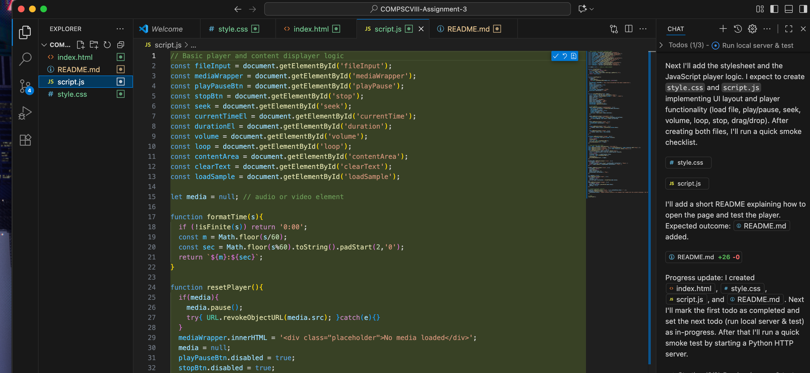
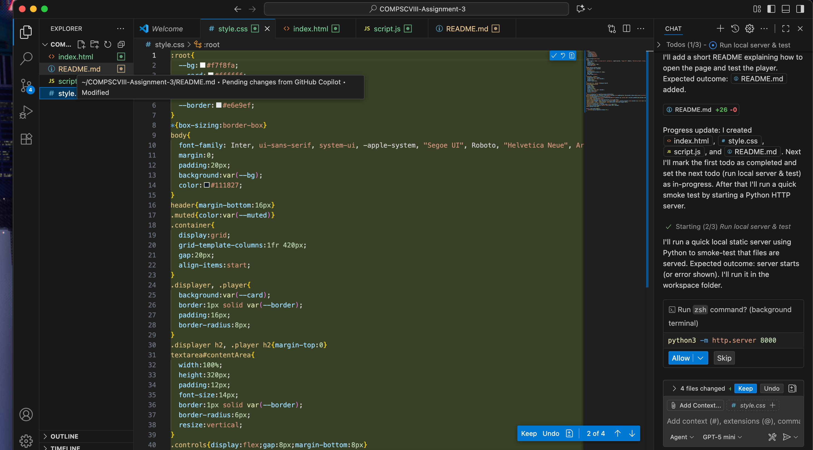
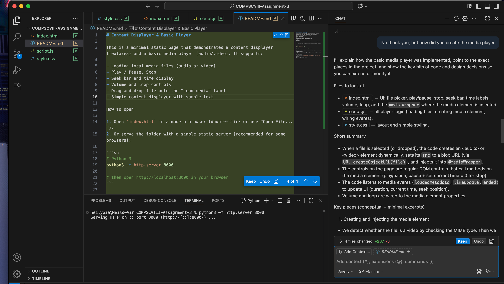

# Reflection Questions
- What did you ask Copilot to help you build? How did you break down the problem?
I asked copilot to help me build a video player with a media player, I  worded the request simply like stated above.
- How did your approach to asking questions change as you worked?
It kind of just did everything the assignment asked me for in one go.
- What parts of the development process with GitHub Copilot surprised you?
The fact that it did so much in such a little time surprised me a lot and that it added all the required files.
- What did you learn about the technology you used that you didn't know before?
I did not know that an OpenAI was capable of good and effective work, I was always told not to use it because the answers are probably wrong.
- What would you do differently if you had to build this again?
I would take the developing process a little slower so I have an idea of what is going on.

Test 